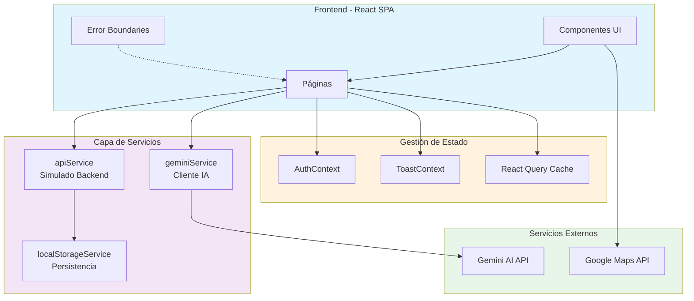
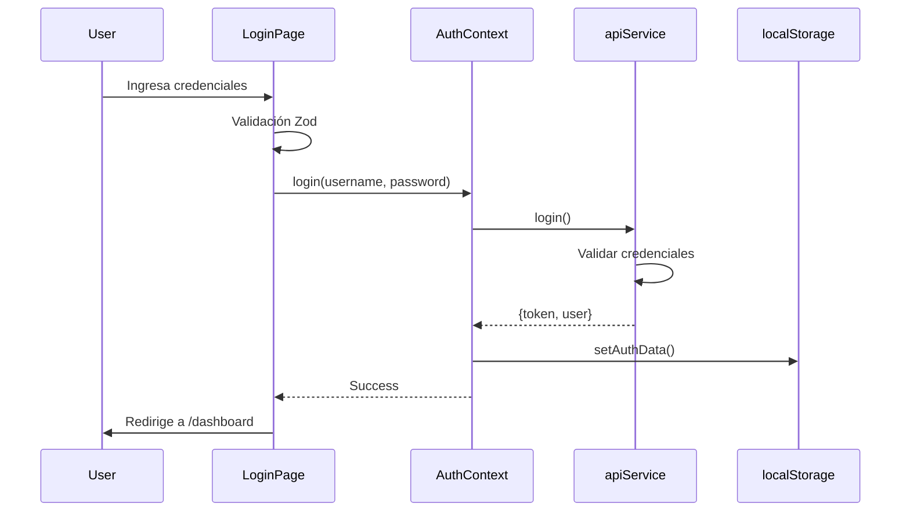
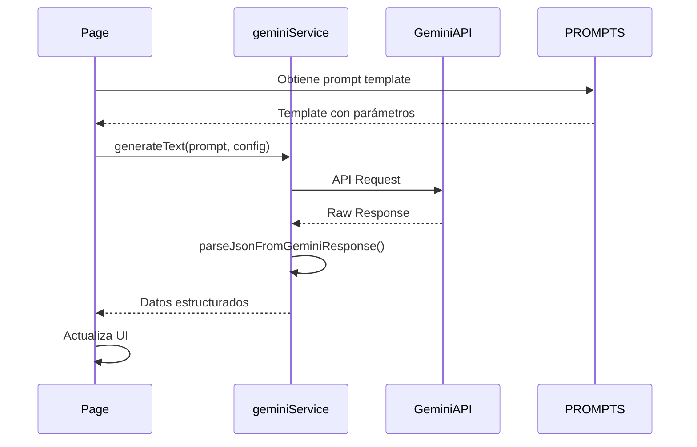

# SmartAICargo v3 - Arquitectura

## Visión General

SmartAICargo v3 es una aplicación web Single Page Application (SPA) construida con React 19 y TypeScript que integra inteligencia artificial (Gemini AI) para optimizar operaciones logísticas de carga.

## Diagrama de Arquitectura



## Flujo de Datos

### Autenticación



### Operación con IA (Gemini)



## Estructura de Componentes

### Jerarquía de Componentes

```
App (ErrorBoundary + Suspense)
├── AuthProvider
│   ├── ToastProvider
│   │   ├── ToastContainer
│   │   └── Routes
│   │       ├── Public Routes
│   │       │   ├── LoginPage (con RHF + Zod)
│   │       │   └── RegisterPage
│   │       └── Protected Routes (ProtectedRoute)
│   │           └── Layout
│   │               ├── Header
│   │               │   └── NotificationBell
│   │               ├── Sidebar
│   │               │   └── NavItem[]
│   │               └── Outlet (páginas)
│   │                   ├── DashboardPage
│   │                   ├── LoadOrchestrationPage
│   │                   ├── VisibilitySecurityPage
│   │                   ├── AlertsPage
│   │                   ├── SustainabilityPage
│   │                   └── CollaborationPage
```

### Componentes Clave

#### Error Handling
- **ErrorBoundary**: Captura errores de React en árbol de componentes
- **ErrorFallback**: UI amigable mostrada cuando ocurre error
- **FormError**: Mensajes de validación consistentes

#### Autenticación
- **ProtectedRoute**: HOC que valida autenticación antes de renderizar
- **AuthContext**: Estado global de usuario autenticado

#### UI Reutilizables
- **LoadingSpinner**: Estado de carga
- **DashboardCard**: Tarjetas de métricas
- **ToastContainer**: Notificaciones toast

## Capa de Servicios

### apiService.ts
**Propósito**: Backend simulado en memoria (TRL-7)

**Funcionalidades**:
- Autenticación (login, register, validateToken)
- CRUD de usuarios  
- CRUD genérico de datos (cargo, vehicles, shipments, alerts)
- Blockchain event logging
- Auto-persistencia en localStorage (v3)

**Patrón**:
```typescript
// Todas las funciones retornan ApiResponse<T>
interface ApiResponse<T> {
  success: boolean;
  data?: T;
  message?: string;
}
```

### geminiService.ts
**Propósito**: Cliente para Gemini AI

**Funcionalidades**:
- `generateText()`: Generación de texto con configuración avanzada
- `parseJsonFromGeminiResponse()`: Parser robusto de JSON
- Funciones específicas: route optimization, risk analysis

**Configuración**:
- Modelo: `gemini-2.5-flash`
- Soporte JSON: `responseMimeType: "application/json"`
- Control de latencia con `thinkingBudget`

### localStorageService.ts
**Propósito**: Persistencia en localStorage

**Mejoras v3**:
- Métodos genéricos `getData<T>()`, `setData<T>()`
- Manejo de cuota excedida
- Validación de disponibilidad
- Info de uso de storage

## Esquemas de Validación (Zod)

### Login
```typescript
loginSchema = z.object({
  username: z.string().min(3),
  password: z.string().min(8)
})
```

### Registro
```typescript
registerSchema = z.object({
  username: z.string().min(3).regex(/^[a-zA-Z0-9_-]+$/),
  email: z.string().email(),
  password: z.string().min(8).regex(/^(?=.*[a-z])(?=.*[A-Z])(?=.*\d)/),
  // ... más campos
})
```

## Tipos de Datos Principales

### Entidades de Negocio
- `CargoOffer`: Ofertas de carga
- `Vehicle`: Vehículos disponibles
- `Shipment`: Envíos en tránsito
- `Alert`: Alertas del sistema
- `UserProfile`: Perfiles de usuarios

### Tipos de IA
- `GeminiRouteSuggestion`: Sugerencias de rutas
- `GeminiRiskAnalysis`: Análisis de riesgos
- `ConsolidationSuggestion`: Sugerencias de consolidación LTL/FTL
- `CarbonFootprintAIAnalysis`: Análisis de sostenibilidad

## Sistema de Rutas

### Configuración
```typescript
<Routes>
  {/* Públicas */}
  <Route path="/login" element={<LoginPage />} />
  <Route path="/register" element={<RegisterPage />} />

  {/* Con Layout */}
  <Route element={<Layout />}>
    <Route path="/" element={<HomePage />} /> {/* Pública */}
    
    {/* Protegidas */}
    <Route element={<ProtectedRoute />}>
      <Route path="/dashboard" />
      <Route path="/loads" />
      <Route path="/shipments" />
      <Route path="/alerts" />
      <Route path="/analytics" />
      <Route path="/settings" />
    </Route>
  </Route>
</Routes>
```

### Control de Acceso
- Guest: `/`, `/login`, `/register`
- Shipper: Dashboard, loads, shipments, alerts, analytics, settings
- Carrier: Dashboard, loads, alerts, analytics, settings
- Admin: Todo

## Testing

### Estrategia
- **Unit Tests**: Servicios (apiService, geminiService)
- **Component Tests**: Componentes UI aislados
- **Integration Tests**: Flujos completos (e.g., AuthFlow)

### Herramientas
- Vitest: Test runner
- React Testing Library: Testing de componentes
- jsdom: Simulación de DOM

### Coverage Objetivo
- >60% general
- >80% en servicios críticos (apiService, geminiService)

## Prompts de IA Centralizados

### Organización
```typescript
PROMPTS = {
  ROUTE: { optimization, ecoRoute },
  RISK: { shipmentRisk, routeRisks },
  CONSOLIDATION: { ltlConsolidation, ftlBackhaul },
  SUSTAINABILITY: { carbonFootprint, esgReport },
  ALERT: { impactAnalysis }
}
```

### Beneficios
- Versionamiento fácil
- Reutilización
- Pruebas A/B de prompts
- Mantenibilidad

## Seguridad

### Variables de Entorno
- `VITE_GEMINI_API_KEY`: API key de Gemini (obligatorio)
- `VITE_GOOGLE_MAPS_API_KEY`: API key de Google Maps (obligatorio)

### Validación de Startup
```typescript
if (!GEMINI_API_KEY) {
  console.error("❌ CRITICAL: VITE_GEMINI_API_KEY is not configured");
}
```

### Control de Acceso
- Tokens simulados en AuthContext
- Rutas protegidas con ProtectedRoute
- Validación por rol en sidebar

## Decisiones de Diseño

### Por qué React Hook Form + Zod?
- **RHF**: Performance (uncontrolled inputs), DX excelente
- **Zod**: Type-safe schemas, errores claros, pequeño bundle

### Por qué Error Boundaries?
- Prevenir white screen of death
- UX degradado graciosamente
- Logging centralizado de errores

### Por qué Vitest sobre Jest?
- Compatibilidad nativa con Vite
- Más rápido (usa esbuild)
- API compatible con Jest

### Backend Simulado vs Real
**v3 mantiene backend simulado para**:
- Desarrollo local sin dependencias
- Demos offline
- Testing end-to-end fácil

**Para producción**: Migrar a backend real (Node.js, PostgreSQL, JWT real)

## Próximos Pasos (v4)

1. **React Query**: Migrar llamadas API a useQuery/useMutation
2. **Storybook**: Documentación visual de componentes
3. **MSW**: Mock Service Worker para tests
4. **Backend Real**: Node.js + Express + PostgreSQL
5. **CI/CD**: GitHub Actions + tests automáticos
6. **PWA**: Soporte offline con Service Workers

## Métricas de Performance

### Objetivos
- **First Contentful Paint**: <1.5s
- **Time to Interactive**: <3s
- **Lighthouse Score**: >90

### Optimizaciones Implementadas
- Code splitting con React.lazy
- Memoización en componentes pesados
- Suspense para estados de carga

## Conclusión

SmartAICargo v3 establece una base sólida para una aplicación de producción con:
- ✅ Testing robusto
- ✅ Validación tipo-safe
- ✅ Manejo de errores profesional
- ✅ Código organizado y mantenible
- ✅ Seguridad mejorada

La arquitectura está diseñada para escalar a millones de envíos con las mejoras propuestas para v4.
